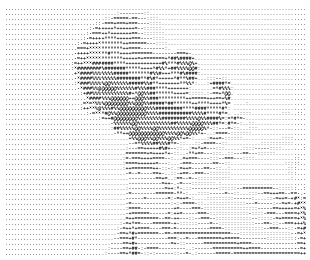

<!--
  SEO Meta: Lionel Mosley | ahr-ki-tekt | IT Consultant | Innovative Thought Leader | Houston TX
  Keywords: IT Consultant, Innovative Thought Leader, Cloud Services, Cybersecurity,
            Infrastructure Governance, Technology Strategy, Microsoft CSP, Digital Transformation,
            Data Center Architect, Lionel Mosley, trust-lionel.com, 4th and Bailey, Houston Texas,
            SCuBA CISA, MITRE ATT&CK, NIST SP 800-53, CIS Benchmarks, Microsoft 365 security,
            cyber resilience, AI governance, BCDR, email security, threat intelligence,
            AWS Amazon Web Services, Microsoft Azure, Google Cloud Platform, Backblaze B2,
            GitHub, PowerShell, Swift, Node.js, Xcode, HTML5, Java, Netlify, Railway, Bunny.net,
            Google Workspace, macOS, Windows Server, Linux, artificial intelligence, machine learning,
            Microsoft Copilot, GitHub Copilot, NIST AI RMF, CISA SCuBA, MITRE ATT&CK,
            NIST SP 800-53, CIS Benchmarks, Microsoft Defender, cybersecurity compliance,
            advisory consultation, IT consulting Houston Texas,
            multi-cloud architecture, open cloud storage, vendor-neutral infrastructure,
            Schedule Advisory Consultation, 4nb.cloud,
            Shopify Sage BusinessWorks integration, middleware agent, Windows Service,
            e-commerce ERP synchronization, ODBC BWGACCESS
-->

<table>
<tr>
<td width="340" valign="top">

</td>
<td valign="top">

```text
trust-lionel --------------------------------------------------------
. OS: ......................... iOS 27, macOS Tahoe, Windows 11 Pro
. Uptime: ..................... 46 years, 6 months, 18 days
. Host: ....................... 4TH AND BAILEY, LLC
. Kernel: ..................... Senior Consultant, IT Strategy Growth & Transformation
. IDE: ........................ Xcode
.
. Languages.Programming: ...... JavaScript, PowerShell, Python, Rust, TypeScript
. Languages.Computer: ......... Astro, CSS, HTML, MDX, SQL, XSLT
. Languages.Real: ............. English
.
. Hobbies.Software: ........... Cloud Computing, Cybersecurity, Web Design
. Hobbies.Other: .............. Cratedigger, Entrepreneur, F1 Enthusiast, Tech Enthusiast

- Contact -------------------------------------------------------------
. Email.Work: ................. inquiries@trust-lionel.com
. LinkedIn: ................... LionelMosley
. Spotify: .................... lmosley002-spotify
. Website: .................... trust-lionel.com

- GitHub Stats ----------------------------------------------------------
. Repos: .... 1 {Contributed: 1} | Stars: ........... 0
. Commits: ................. 22 | Followers: ....... 1
. Lines of Code on GitHub:. pending (requires authenticated API — see update_stats.py)
```


</td>
</tr>
</table>
