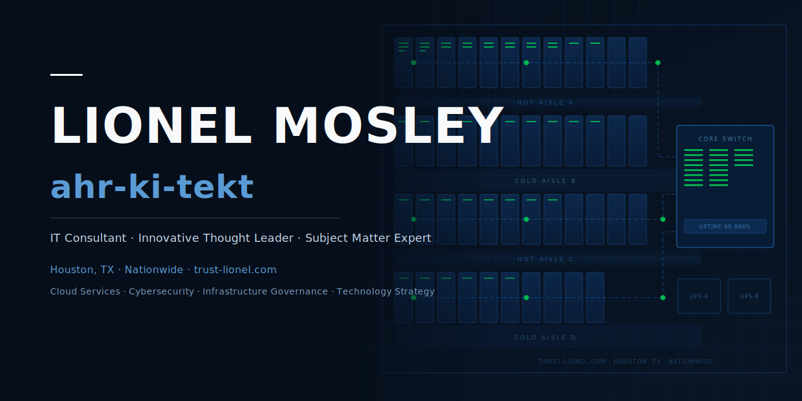

<!--
  SEO Meta: Lionel Mosley | ahr-ki-tekt | IT Consultant | Innovative Thought Leader | Houston TX
  Keywords: IT Consultant, Innovative Thought Leader, Cloud Services, Cybersecurity,
            Infrastructure Governance, Technology Strategy, Microsoft CSP, Digital Transformation,
            Data Center Architect, Lionel Mosley, trust-lionel.com, 4th and Bailey, Houston Texas,
            SCuBA CISA, MITRE ATT&CK, NIST SP 800-53, CIS Benchmarks, Microsoft 365 security,
            cyber resilience, AI governance, BCDR, email security, threat intelligence,
            AWS Amazon Web Services, Microsoft Azure, Google Cloud Platform, Backblaze B2,
            GitHub, PowerShell, Swift, Node.js, Xcode, HTML5, Java, Netlify, Railway, Bunny.net,
            Google Workspace, macOS, Windows Server, Linux, artificial intelligence, machine learning,
            Microsoft Copilot, GitHub Copilot, NIST AI RMF, CISA SCuBA, MITRE ATT&CK,
            NIST SP 800-53, CIS Benchmarks, Microsoft Defender, cybersecurity compliance,
            advisory consultation, IT consulting Houston Texas,
            multi-cloud architecture, open cloud storage, vendor-neutral infrastructure,
            Schedule Advisory Consultation, 4nb.cloud,
            Shopify Sage BusinessWorks integration, middleware agent, Windows Service,
            e-commerce ERP synchronization, ODBC BWGACCESS
-->

<div align="center">

<a href="#who-i-am">Home</a> &nbsp;·&nbsp; <a href="#published-work--frameworks">Published Work</a> &nbsp;·&nbsp; <a href="#thought-leadership">Thought Leadership</a> &nbsp;·&nbsp; <a href="#beyond-the-work">Beyond the Work</a> &nbsp;·&nbsp; <a href="#connect">Connect</a> &nbsp;&nbsp;|&nbsp;&nbsp; <a href="https://4nb.cloud/lmosley"></a>

</div>

<div align="center">
  
</div>

---

<!-- SEO: Primary identity and value proposition -->
## Who I Am

I am **Lionel Mosley** — an IT Consultant, Innovative Thought Leader, and Subject Matter Expert operating at the intersection of technology, strategy, and innovation.

I don't just consult. I **design**.

Frameworks. Infrastructure. Solutions for problems that haven't been named yet. Across cloud services, cybersecurity, infrastructure governance, and technology strategy — serving organizations nationwide through **[4TH AND BAILEY](https://github.com/4thandbailey)**.

> *"I've spent my career asking 'what if' when everyone else was asking 'how much.'"*

---

<!-- SEO: Core competencies and keywords -->
## What I Architect

```
☁  Cloud Services & Infrastructure        🔐  Cybersecurity
🏛  Infrastructure Governance              🤝  Microsoft CSP
📐  Technology Strategy                    🔄  Digital Transformation
🖥  Data Center Architecture               🌐  Enterprise IT Solutions
```

---

<!-- SEO: Skill Stack -->
## Skill Stack

**Cloud Platforms**

<a href="https://aws.amazon.com"></a>&nbsp;
<a href="https://azure.microsoft.com"></a>&nbsp;
<a href="https://cloud.google.com"></a>&nbsp;
<a href="https://www.backblaze.com/cloud-storage"></a>&nbsp;
<a href="https://netlify.com"></a>&nbsp;
<a href="https://railway.app"></a>&nbsp;
<a href="https://bunny.net"></a>

**Productivity & Collaboration**

<a href="https://microsoft.com/microsoft-365"></a>&nbsp;
<a href="https://workspace.google.com"></a>&nbsp;
<a href="https://github.com"></a>

**Development & Runtime**

<a href="https://nodejs.org"></a>&nbsp;
<a href="https://swift.org"></a>&nbsp;
<a href="https://developer.apple.com/xcode"></a>&nbsp;
<a href="https://learn.microsoft.com/powershell"></a>&nbsp;
<a href="https://developer.mozilla.org/docs/Web/HTML"></a>&nbsp;
<a href="https://java.com"></a>

**Operating Systems & Platforms**

<a href="https://www.apple.com/macos"></a>&nbsp;
<a href="https://www.microsoft.com/windows-server"></a>&nbsp;
<a href="https://www.linux.org"></a>

**Artificial Intelligence & Emerging Technology**

<a href="https://www.nist.gov/artificial-intelligence"></a>&nbsp;
<a href="https://www.nist.gov/system/files/documents/2023/01/26/AI%20RMF%201.0.pdf"></a>

**Cybersecurity & Compliance**

<a href="https://www.cisa.gov/resources-tools/services/secure-cloud-business-applications-scuba-project"></a>&nbsp;
<a href="https://attack.mitre.org"></a>&nbsp;
<a href="https://csrc.nist.gov/publications/detail/sp/800-53/rev-5/final"></a>&nbsp;
<a href="https://www.cisecurity.org/cis-benchmarks"></a>

---

<!-- SEO: Projects and published work — Card View -->
## Published Work & Frameworks

<table>
<tr>

<td width="33%" valign="top" align="center">
<a href="https://github.com/4thandbailey">

</a>
<br/><br/>
<strong><a href="https://github.com/4thandbailey">4TH AND BAILEY</a></strong>
<br/>
<sub>Cloud Services · Cybersecurity · Infrastructure Governance · Technology Strategy</sub>
<br/><br/>
<sub>🏢 Organization</sub>
</td>

<td width="33%" valign="top" align="center">
<a href="https://devops.houstonalert.com">

</a>
<br/><br/>
<strong><a href="https://devops.houstonalert.com">Houston Alert</a></strong>
<br/>
<sub>Real-time road, flood & emergency monitoring for 160 Houston metro ZIP codes</sub>
<br/><br/>
<sub>🚨 DevOps Blog</sub>
</td>

<td width="33%" valign="top" align="center">
<a href="https://framework.4thandbailey.com">

</a>
<br/><br/>
<strong><a href="https://framework.4thandbailey.com">Infrastructure Placement Framework</a></strong>
<br/>
<sub>A comprehensive decision framework for infrastructure placement strategy</sub>
<br/><br/>
<sub>📐 Open Source Framework</sub>
</td>

</tr>
<tr>

<td width="33%" valign="top" align="center">
<a href="https://github.com/trust-lionel/macsystools">

</a>
<br/><br/>
<strong><a href="https://github.com/trust-lionel/macsystools">MacSysTools</a></strong>
<br/>
<sub>Native macOS system administration app built with SwiftUI + Xcode for macOS Tahoe</sub>
<br/><br/>
<sub>🖥 Swift · Xcode · macOS Tahoe</sub>
</td>

<td width="33%" valign="top" align="center">
<a href="https://github.com/4thandBailey/shopify-bw-agent">

</a>
<br/><br/>
<strong><a href="https://github.com/4thandBailey/shopify-bw-agent">Shopify ↔ Sage BusinessWorks Middleware Agent</a></strong>
<br/>
<sub>Windows background service that automatically synchronizes orders, inventory, fulfillments, customers, and pricing between Shopify and Sage BusinessWorks</sub>
<br/><br/>
<sub>⚙️ Node.js · JavaScript · Windows Service</sub>
</td>

<td width="33%" valign="top" align="center">
<a href="blog/three-questions.html">

</a>
<br/><br/>
<strong><a href="blog/three-questions.html">Three Questions Every CEO and Board Should Be Able to Answer</a></strong>
<br/>
<sub>Cyber resilience, AI governance, and business continuity — the three questions that determine whether an organization survives</sub>
<br/><br/>
<sub>📝 Thought Leadership · May 17, 2026</sub>
</td>

</tr>
<tr>

<td width="33%" valign="top" align="center">
<a href="blog/vibe-coding.html">

</a>
<br/><br/>
<strong><a href="blog/vibe-coding.html">Vibe Coding — How I Built My Personal Brand in One Night</a></strong>
<br/>
<sub>From zero GitHub presence to a fully live personal brand at trust-lionel.com — in one session</sub>
<br/><br/>
<sub>📝 Thought Leadership · May 16, 2026</sub>
</td>

<td width="33%" valign="top" align="center">
<a href="blog/microsoft-notification-abuse.html">

</a>
<br/><br/>
<strong><a href="blog/microsoft-notification-abuse.html">When Microsoft's Own Email Becomes the Weapon</a></strong>
<br/>
<sub>A Microsoft CSP's analysis through CISA SCuBA, MITRE ATT&CK, NIST SP 800-53, and CIS Benchmarks</sub>
<br/><br/>
<sub>📝 Thought Leadership · May 22, 2026</sub>
</td>

<td width="33%" valign="top">
</td>

</tr>
</table>

---

<!-- SEO: Thought leadership content section -->
## Thought Leadership

I publish ideas, frameworks, and solutions here on GitHub because I believe the open web — not a walled platform — is where credibility is built.

Every commit is a published thought.
Every repository is a documented solution.
Every framework is proof of work.

**Topics I write about:**
- Enterprise IT strategy and infrastructure design
- Data center architecture and governance models
- Cloud architecture and digital transformation
- Innovation frameworks for technology leaders
- Technology consulting insights across industries

---

<!-- SEO: Personal dimension -->
## Beyond the Work

I believe the best thinking happens when you make space for it.

Currently listening to music that creates that space — because some problems need room to breathe before the architecture reveals itself.

---

<!-- SEO: Connect and call to action -->
## Connect

<div align="center">

<a href="https://linkedin.com/in/lionelmosley"></a>&nbsp;
<a href="https://github.com/4thandbailey"></a>&nbsp;
<a href="https://reddit.com/u/trust-lionel"></a>&nbsp;
<a href="https://open.spotify.com/user/lmosley002-spotify?si=5378efbde0b14063"></a>

</div>

---

<!-- SEO: Location and organization signals -->
<div align="center">

<sub>© 2026 Lionel Mosley &nbsp;·&nbsp; Houston, TX &nbsp;·&nbsp; Serving Organizations Nationwide</sub>

</div>
